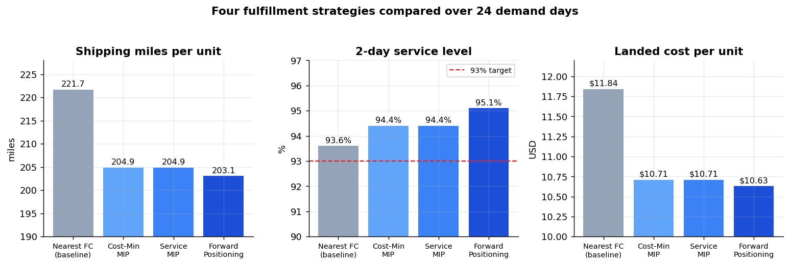
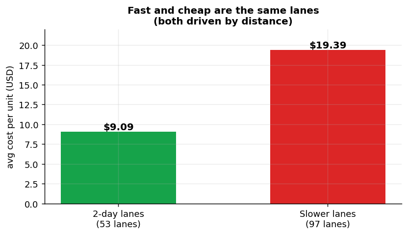
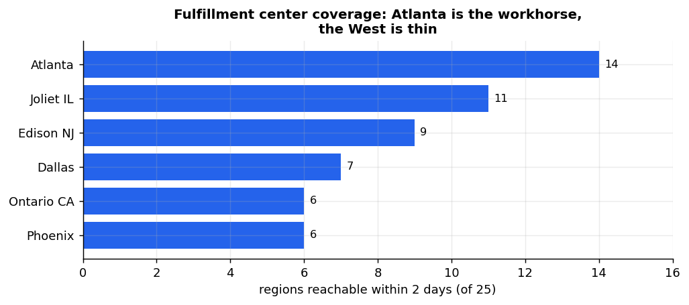

# Fulfillment Network Optimization + AI Sourcing Agent

**In one sentence:** this project works out the cheapest and fastest way to ship online orders from warehouses to customers, and then puts an AI assistant on top of that engine so a contractor can just describe a project in plain English and get an instant sourcing plan back.

There are two halves, and the second builds on the first:

1. **The optimization engine** decides which warehouse should ship which product to which city. It cut shipping distance by **8.4%** while still getting **95%** of orders delivered within two days.
2. **The AI agent** lets a professional customer describe a project in their own words, like "I need 120 studs and 6 rolls of wire in Atlanta." It understands the request, calls the engine, and hands back a sourcing and fulfillment plan with an estimated cost.

Everything runs in Python. The engine uses mathematical optimization. The agent uses the Anthropic API for language and a FastAPI web service to expose it.

---

## Why this problem is harder than it looks

A two-day delivery promise seems simple from the customer's side. Behind the scenes, several decisions have to line up at the same time:

- The **closest** warehouse is the fastest, but it might be out of stock or already at capacity.
- The **cheapest** warehouse might be far away, which breaks the two-day promise.
- Every warehouse holds **limited inventory** and can only pack so many orders per day.

These goals pull against each other. That is exactly why optimization is needed. You cannot get all three for free, so the job is to find the best possible balance, and that is what this project measures.

---

## The results

Four strategies were tested against a full year of simulated demand, sampled across 24 days including the busiest days of the year like Black Friday and Cyber Monday.



| Strategy | Miles per unit | vs Baseline | 2-Day Service | Cost per unit |
|---|---|---|---|---|
| Nearest FC (baseline) | 221.7 | n/a | 93.6% | $11.84 |
| Cost-Minimizing model | 204.9 | down 7.6% | 94.4% | $10.71 |
| Service-Constrained model | 204.9 | down 7.6% | 94.4% | $10.71 |
| **Forward Positioning (best)** | **203.1** | **down 8.4%** | **95.1%** | **$10.63** |

The best strategy improved all three numbers at once, fewer miles, better service, and lower cost. That was possible because the naive "just use the nearest warehouse" baseline was genuinely wasteful, so there was a lot of room to do better.

### The finding I did not expect

I assumed faster delivery would cost more. It barely did.



Short shipping routes turned out to be both faster and cheaper, because both speed and cost come down to distance. So minimizing cost automatically produced good delivery speed. When I tested delivery targets from 90% all the way to 95%, the answer barely changed. In plain terms, the company does not really face a cost versus speed tradeoff in its normal operating range. That is useful to know before spending money defending a delivery target it already hits for free.

### The real bottleneck

The network has no warehouse in the Pacific Northwest, so Seattle and Portland sit more than 1,000 miles from every warehouse and can never reach two-day delivery. That caps the best possible service level at about 95%, no matter how clever the routing gets.



The lesson is that the real constraint was **where the warehouses are**, not how orders get routed. That is the kind of finding that changes a business decision, like whether to build a new warehouse, rather than just tuning software.

---

## How the whole thing works


A contractor sends a plain-English request. The AI agent reads it, pulls out the products and quantities, and calls the sourcing tool. The sourcing tool matches each vague description to a real catalog product, checks inventory across the six warehouses, and runs the optimization engine to produce a plan. The agent reads that plan back to the customer. Everything is exposed over a web API.

There is one rule the whole design follows: **the AI never does the math.** Language models are not reliable at arithmetic or hard constraints, so the agent only handles language and decides when to call the optimizer. The actual optimization is done by a proper solver behind a clean boundary. That is how you build an AI assistant that has to hand back numbers people can trust.

---

## The project, part by part

The project was built in eight stages. Each stage is a file or two in the `src/` folder.

### Part 1: Generate the demand data (`generate_demand.py`)
Real order data is private, so this builds a realistic year of fake orders: 3.6 million units across 25 cities and 12 products. It bakes in the patterns real demand has, like busier Mondays, big spikes on Black Friday and Cyber Monday, and larger cities ordering more. The variability is modeled so that demand is lumpy the way real orders are, not artificially smooth.

### Part 2: Map the network (`network.py`)
Calculates the real distance between every warehouse and every city, correctly accounting for the curve of the earth, then adds about 20% because roads are longer than a straight line. It turns those distances into shipping cost and delivery time using a carrier-style zone chart. The output is a table of 150 shipping routes, each tagged with whether it can deliver in two days.

### Part 3: The optimization model (`optimizer.py`)
This is the heart of the project. It is a mixed-integer program, which means it mixes normal number decisions (how many units to ship on each route) with yes/no decisions (whether to even open a warehouse for the day). It picks the combination that costs the least while respecting inventory limits, warehouse capacity, and the two-day delivery promise. It solves in under a second per day using a free solver.

### Part 4: Inventory placement and the experiment (`inventory.py`, `run_simulation.py`)
Routing can only ship what a warehouse already holds, so where you put stock matters as much as how you route orders. This tests three ways of placing inventory, then runs all four strategies across the sampled days and collects the results.

### Part 5: Analysis and charts (`analyze.py`)
Turns the raw results into the comparison table, the busy-day stress test, and the finding that the service constraint never actually kicks in. It also produces the charts above.

### Part 6: Product matching (`catalog.py`, `match.py`, `sourcing_tool.py`)
This is the bridge to the AI half. A contractor types "half inch copper elbow," not a product code. This layer scores that vague text against a catalog of real home-improvement products and picks the right one, or declines if nothing fits well enough, because guessing wrong on a business order is worse than asking. The sourcing tool bundles the matcher and the optimizer into a single function an AI can call.

### Part 7: The agent and web service (`agent.py`, `api.py`)
The AI agent uses the Anthropic API to read a plain-English request, call the sourcing tool, keep track of the conversation across turns, and record a trace of what it did and why. FastAPI exposes all of it over the web with proper endpoints. It also has an offline mode that needs no API key, so the tests run anywhere.

### Part 8: Evaluating the matcher (`eval_dataset.py`, `eval_matcher.py`)
Measures how good the matching layer actually is, using a hand-labeled set of hard queries: typos, abbreviations, and tricky "wrong variant" cases like asking for a 3/4 inch part when only 1/2 inch is stocked.

**Results on 40 held-out queries:**

| Metric | Score | What it means |
|---|---|---|
| Top-1 accuracy | **96%** | Correct product is the number one pick |
| Top-3 recall | **100%** | Correct product is always in the top three |
| Match precision | **80%** | Of what it auto-matched, how much was right |
| Correct declines | **57%** | How often it refused a wrong-variant or nonsense query |

The evaluation did its job. The first version was accepting wrong-variant queries most of the time, so I added a check that notices when a size does not match (that 3/4 is not the same as 1/2). That raised correct declines from **36% to 57%** while keeping 96% accuracy. The gap that is left is the honest ceiling of this simpler matching approach. Closing it further would need a semantic model, and that limitation is written down rather than hidden.

---

## Repository layout

```
src/
  generate_demand.py   Part 1: synthetic order data
  network.py           Part 2: distances, shipping zones, route costs
  optimizer.py         Part 3: the mixed-integer optimization model
  inventory.py         Part 4: inventory placement strategies
  run_simulation.py    Part 4: runs all four scenarios
  analyze.py           Part 5: results and charts
  catalog.py           Part 6: home-improvement product catalog
  match.py             Part 6: text-to-product matching
  sourcing_tool.py     Part 6: the agent-callable engine wrapper
  agent.py             Part 7: the AI agent (Anthropic API + offline mode)
  api.py               Part 7: the FastAPI web service
  eval_dataset.py      Part 8: labeled test set for the matcher
  eval_matcher.py      Part 8: evaluation harness
  config.py            all settings in one place
tests/
  test_sourcing.py     matching and sourcing checks
  test_api.py          agent and API checks (runs fully offline)
  test_eval.py         matcher evaluation checks
outputs/
  figures/             the charts in this README
  results/             metrics and evaluation output
```

---

## How to run it

```bash
pip install -r requirements.txt

# The optimization engine
python src/generate_demand.py          # build the demand data
python src/network.py                  # map the network
python src/run_simulation.py --days 24 # run the four strategies
python src/analyze.py                  # results and charts

# The AI agent
python src/agent.py                    # demo the agent (works with no API key)
python src/api.py                      # start the web service, open /docs
```

The agent works out of the box in offline mode. To use the real Anthropic API for language understanding, set your key first:

```bash
export ANTHROPIC_API_KEY=sk-ant-your-key
python src/agent.py
```

Try the web service directly:

```bash
python src/api.py
# then, in another terminal:
curl -X POST http://127.0.0.1:8000/tool/source \
  -H "Content-Type: application/json" \
  -d '{"line_items":[{"query":"2x4 studs 8ft","quantity":50}],"dest_region":"Dallas"}'
```

Interactive API docs open at **http://127.0.0.1:8000/docs**.

## Tests

```bash
python tests/test_sourcing.py
python tests/test_api.py
python tests/test_eval.py
```

The tests check real properties, like the fact that a constrained solution can never beat an unconstrained one, that nonsense queries get declined, and that unknown sessions return an error. They do not just check fixed numbers.

---

## Honest limitations

- **The data is synthetic.** It is built to match the shape of real demand, and the logic runs unchanged on real data with the same structure, but the specific numbers are illustrative.
- **Each day is solved on its own.** Inventory does not carry from one day to the next. A production version would connect the days together.
- **The matcher is text-based.** It is fast and easy to explain, but it tops out around 57% on the hard wrong-variant cases. A semantic model would push that higher.
- **The matcher's accuracy numbers come from a test set I wrote myself.** The method is sound, but the specific numbers are an internal benchmark, not a production estimate.

These are written down on purpose. Knowing exactly where a system breaks is more useful than pretending it does not.

---

## Tech stack

Python, PuLP with the CBC solver, pandas, NumPy, matplotlib, FastAPI, Anthropic API.
