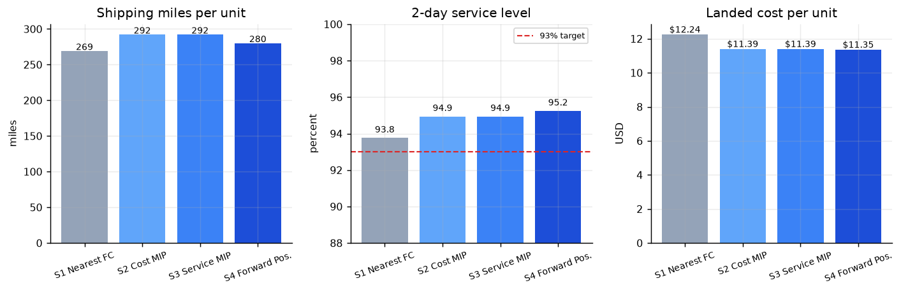
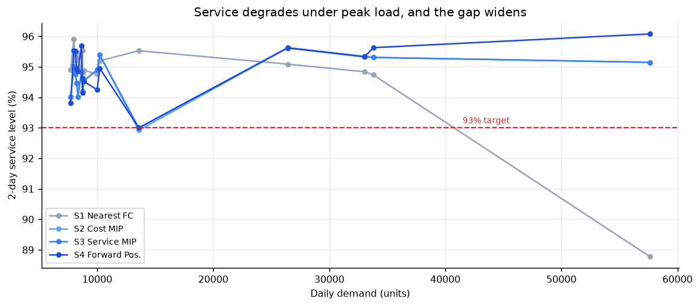

# Fulfillment Network Optimization

Mixed-integer optimization model that routes e-commerce orders across six US
fulfillment centers, cutting shipping miles 8.4% while holding 95.1% of orders
within a two-day delivery window.

## Problem

A direct-to-consumer retailer ships roughly 3.6M units per year from six
fulfillment centers to 25 metro demand regions, promising two-day delivery.
Three objectives compete:

- **Cost** favors shipping from the lowest-cost building
- **Speed** favors shipping from the closest building
- **Feasibility** limits both, since buildings have finite inventory and finite
  daily throughput

The model decides which FC ships which SKU to which region, and how inventory
should be positioned in advance to make that routing possible.

## Results

Four strategies compared across 24 stratified simulation days, with the four
heaviest days of the year force-included.

| Strategy | Miles/Unit | vs Baseline | 2-Day Service | Landed $/Unit | Cost vs Base |
|---|---|---|---|---|---|
| Baseline: Nearest FC | 221.7 | — | 93.6% | $11.84 | — |
| Cost-Minimizing MIP | 204.9 | −7.6% | 94.4% | $10.71 | −9.5% |
| Service-Constrained MIP | 204.9 | −7.6% | 94.4% | $10.71 | −9.5% |
| **Pooled + Forward Positioning** | **203.1** | **−8.4%** | **95.1%** | **$10.63** | **−10.2%** |



### The gap widens under load

Baseline service falls below the 93% target on peak days. The optimized
strategy holds above it.

| | Normal days | Peak days | Degradation |
|---|---|---|---|
| Nearest FC | 94.7% | 92.5% | −2.2 pp |
| Forward Positioning | 95.6% | 94.4% | −1.2 pp |



## Three findings

**1. The service constraint never binds under this cost structure.**
Two-day lanes average $8.55/unit against $16.87 for slower lanes, because both
cost and transit time are driven by distance. Cost minimization alone achieves
95.1% service, so every target from 90% to 95% is satisfied for free. A
sensitivity sweep across that range produced identical cost and identical
routing. The company does not face a cost-service tradeoff in its current
operating band.

**2. Routing is the first-order lever; placement is where the remaining
headroom sits.**
Switching from greedy nearest-FC routing to the MIP cut miles 7.6%. Then
changing *only* the inventory placement policy, holding the routing model and
service constraint fixed, added a further 0.9% on miles and 0.70 pp on service.
Routing dominates the initial gain but is largely exhausted afterward.

**3. The network has a structural coverage hole.**
Seattle and Portland sit more than 1,000 road miles from every FC, so no lane
reaches them within two days. Portland misses the Zone 5 cutoff by 1.5 miles.
That caps the achievable service level at 95.36% regardless of routing quality,
and it is the binding constraint on the network, not routing sophistication.

## Model

**Decision variables**
- `x[f,r,s]` continuous — units of SKU `s` shipped from FC `f` to region `r`
- `y[f]` binary — whether FC `f` is activated for the day
- `u[r,s]` continuous — unmet demand, penalized in the objective

**Objective**

```
min  Σ c[f,r]·x[f,r,s]        shipping + handling
   + Σ K[f]·y[f]              fixed cost of activated FCs
   + p·Σ x[f,r,s] | slow      late-delivery penalty
   + g·Σ u[r,s]               stockout penalty
```

**Constraints**

| # | Constraint | Form |
|---|---|---|
| 1 | Demand balance | `Σ_f x[f,r,s] + u[r,s] = D[r,s]` |
| 2 | Inventory availability | `Σ_r x[f,r,s] ≤ I[f,s]` |
| 3 | Capacity with activation linking | `Σ_r,s x[f,r,s] ≤ Q[f]·y[f]` |
| 4 | Service level | `Σ δ[f,r]·x[f,r,s] ≥ α·Σ x[f,r,s]` |

Roughly 1,800 variables, solved with CBC to a 1% optimality gap in under one
second per day.

Three modeling choices worth noting:

- **Constraint 3 doubles as a Big-M link.** Multiplying capacity by the binary
  forces `y[f]=1` whenever anything ships. `M` is set to actual capacity rather
  than an arbitrary large constant, because a loose `M` weakens the LP
  relaxation and expands the branch-and-bound tree.
- **Constraint 4 is a linearized ratio.** The natural form is
  `Σ fast / Σ total ≥ α`, which is nonlinear. Multiplying through by the
  denominator yields a linear inequality.
- **Unmet demand is a penalized variable, not an infeasibility.** A model that
  can only return INFEASIBLE tells an operator nothing. The elastic formulation
  always solves and reports exactly which region-SKU pairs failed and by how
  much.

## Data

Synthetic, generated from `src/generate_demand.py` under a fixed seed. Real
order-level fulfillment data is proprietary; what matters for network design is
that demand carries the right structural properties, all four of which are
generated explicitly and validated:

- Weekly seasonality (Monday peak, Saturday trough)
- Q4 concentration with explicit Black Friday and Cyber Monday spikes
  (December/June ratio 1.99, against a published e-commerce range of 1.7–2.2)
- Regional skew proportional to metro population
- Overdispersed SKU-level variance via a gamma-Poisson mixture, with the Gamma
  shape set to 1/cv² so per-SKU volatility is controlled directly

The optimization is agnostic to data source. A real orders table with the same
schema runs unchanged.

## Repository layout

```
src/
  config.py             all tunable parameters
  generate_demand.py    synthetic order history
  network.py            distances, zones, lane costs, coverage analysis
  optimizer.py          the MIP, plus the baseline heuristic
  inventory.py          three placement policies
  run_simulation.py     scenario harness
  analyze.py            results, decomposition, sensitivity, figures
tests/
  check_part1.py        data validation
  inspect_lanes.py      lane matrix inspection
  test_optimizer.py     MIP correctness assertions
  test_allocation.py    placement policy comparison
outputs/
  results/              scenario metrics and summaries
  figures/              charts
```

## Running it

```bash
pip install -r requirements.txt

python src/generate_demand.py          # build the demand data
python src/network.py                  # build lane matrix, coverage report
python src/run_simulation.py --days 24 # run all four scenarios
python src/analyze.py                  # results, figures, sensitivity
```

Full pipeline takes about two minutes.

## Validation

`tests/test_optimizer.py` checks mathematical invariants rather than hardcoded
outputs. The key one: the service-constrained objective must be greater than or
equal to the unconstrained objective, because adding a constraint can never
improve an optimum. If that inverts, the model is wrong.

## Limitations

- **Single-period.** Each day is solved independently with a fresh inventory
  position. Real inventory is a state variable linking periods, so this cannot
  represent depletion dynamics or replenishment lead times. A multi-period
  extension would add inventory balance constraints between consecutive days
  and solve on a rolling horizon.
- **Flat circuity factor.** Road distance is approximated as great-circle
  distance times 1.20. Mountain West lanes run higher, flat Midwest lanes lower.
  Production would use routed distances from a mapping API, cached for
  reproducibility.
- **Peak days are over-represented** relative to their annual frequency, since
  they are force-included in the sample. Results describe representative
  operating conditions rather than an unbiased annual average.
- **Continuous shipment quantities.** Fractional units are a harmless relaxation
  at these volumes. If the shipping unit were pallets, integrality would matter.

## Stack

Python, PuLP with the CBC solver, pandas, NumPy, matplotlib.